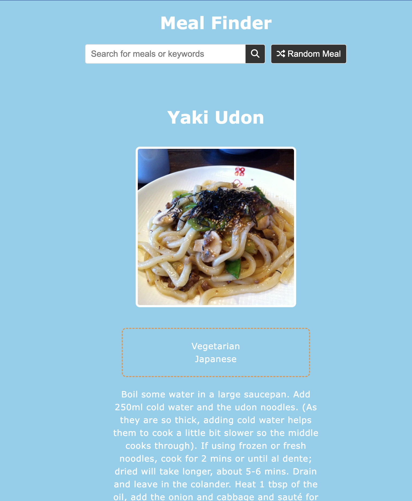

# Meal Finder

## Description

This is a simple meal finder app that uses the themealdb.com API to search for meals based on the name of the meal or a single ingredient. The app displays the meals in a card format with an image of the meal and the name of the meal. When a user clicks on a meal, the app displays the ingredients and instructions on how to make the meal. The app also has a random meal button that displays a random meal when clicked.

## Technologies Used

- HTML
- CSS
- JavaScript

---

